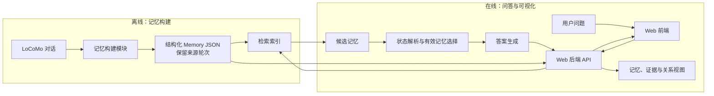

# Project Proposal

---

## 一、问题背景与痛点

- **长程对话中状态会持续变化**：用户的工作、居住、计划、偏好等信息在多会话之间不断被更新，例如从"在准备领养申请"到"通过领养面试"。
- **普通向量检索无法区分新旧信息**：它按语义相似度召回，可能同时把**当前状态**与**已被后续信息更新的历史状态**取出，模型无法判断哪条仍然有效。
- **后果是给出过期答案**：系统基于已失效的状态回答当前问题，产生错误回答或错误决策，且错误往往难以察觉。

## 二、目标范围

- 结构化记忆构建：从原始对话抽取人物、事件、时间、状态，统一导出为 JSON，并可回溯到原始出处。
- 动态状态解析：判定记忆之间的 RETAIN / UPDATE（SUPERSEDE）/ CONFLICT 关系，确定当前有效记忆。
- 有效记忆检索与答案生成：检索相关记忆 → 解析状态 → 调用 DeepSeek 生成答案。
- Web 应用：展示结构化记忆、原始证据与状态演化过程。
- 评测与对照分析：按三个指标评测，与 Full Text、Vector RAG 两种基准方法对比。

## 三、数据方案

- **数据范围**：使用课程指定的 6 段 LoCoMo 对话（4 段开发、2 段独立测试，编号待公布）；仅从原始对话构建记忆，gold evidence、标准答案及标注摘要不进入抽取与检索输入。
- **清洗与抽取**：过滤图片链接及多模态派生字段，保留说话人、会话时间和原始轮次 ID；按会话分块，将人物、事件和状态抽取为原子事实。区分会话时间与事件时间，保留相对时间原文；不确定的时间留空。
- **Memory 结构**：每条记录包含唯一 ID、事实内容、实体/属性/值、会话时间、事件时间及来源轮次列表；前后状态分别保留，供推理模块按问题判断 RETAIN / UPDATE / SUPERSEDE / CONFLICT。
- **存储与检索**：按对话导出并复用 `outputs/memory/<conversation_id>.json`，配套原始证据；已实现 BM25 与 MiniLM 向量召回，通过 RRF 按 Memory ID 合并去重，返回有序 Top-K、分数与来源。实际召回效果待开发集评测。
- **示例与验收**：课件第 12 页的 Caroline / D19:1“上周五通过领养面试”，抽取为 `Caroline · adoption_status · passed adoption agency interviews`，同时保留 `last Friday` 和原始证据。验收重点是 JSON 可读写、证据可回溯、对话间不串库。

## 四、技术方案

### 1. 整体处理流水线

系统采用“**记忆构建 → 多路检索 → Query 分析 → 状态关系判定 → 有效记忆选择 → 答案生成**”的处理流程。

- **记忆构建**：读取 LoCoMo 历史对话，将人物、事件、时间和状态等信息抽取为结构化 Memory，并保留对应的原始对话轮次作为证据。
- **多路检索**：根据用户问题，从结构化 Memory 中召回与人物、事件、属性和时间相关的候选记忆，并对不同检索通道的结果进行合并、去重。
- **Query 分析**：识别当前问题涉及的核心人物、事件、属性、时间范围等信息，为后续状态判断提供约束。
- **状态关系判定**：对候选历史记忆进行比较，判断记忆之间属于 **RETAIN、UPDATE、SUPERSEDE 或 CONFLICT** 哪一种关系。
- **有效记忆选择与答案生成**：过滤已经被新信息替代或存在冲突的历史状态，仅保留当前有效记忆，再将有效记忆交给 DeepSeek 生成最终答案。

**核心思路：不直接把所有历史检索结果交给模型，而是在答案生成前增加一层“动态状态解析”。**

### 2. 检索通道设计

初步采用“**关键词检索 + 向量检索**”的多路召回方案：

- **关键词/BM25 检索**：适合人物名称、事件名称、明确属性等具有较强词面特征的问题。
- **向量检索**：利用语义相似度召回表达方式不同但语义相关的历史记忆，提高对自然语言问题的覆盖能力。
- **结果合并与去重**：对多路检索结果统一映射到 Memory ID，并根据相关性进行排序，同时删除重复记忆。
- 后续根据实验结果决定是否增加**维度检索或图关系检索**，避免在 Proposal 阶段过早增加系统复杂度。

### 3. Query 分析

针对用户问题，首先提取影响答案判断的关键信息：

| 分析维度 | 示例                       |
| -------- | -------------------------- |
| 人物     | 用户本人、朋友、家庭成员   |
| 时间     | 当前、过去、某一具体时间   |
| 属性     | 工作、居住地、计划、偏好等 |
| 事件     | 搬家、换工作、完成申请等   |
| 状态     | 正在进行、已完成、已改变等 |

Query 分析结果用于限制候选 Memory 的范围，使后续状态关系判断集中在与当前问题真正相关的历史信息上。

### 4. 动态状态关系判定

对检索得到的候选 Memory，根据其内容、时间和原始证据进行两两比较，由模型判断四种关系：

- **RETAIN**：两条记忆描述的是可以同时成立的信息，不需要替换。
- **UPDATE**：后续信息对已有状态进行了补充或修改，应使用更新后的状态。
- **SUPERSEDE**：新记忆明确取代旧记忆，旧状态不再作为当前有效状态使用。
- **CONFLICT**：两条记忆存在无法直接同时成立的矛盾，需要结合时间、上下文和证据进一步判断。

状态判断 Prompt 重点要求模型关注**时间顺序、人物一致性、属性一致性和事件上下文**，而不是单纯依据语义相似度判断新旧关系。

### 5. 参考方法与方案取舍

本项目参考 **DimMem** 的结构化记忆和维度检索思想，以及 **MRAgent** 的 Cue–Tag–Content 和主动检索思路，但不完全复刻其完整实现。

- 保留结构化 Memory，便于记录状态、时间和原始证据。
- 保留多维度检索思想，提高不同类型问题的召回能力。
- 将本项目重点放在 **RETAIN / UPDATE / SUPERSEDE / CONFLICT 动态关系判定** 上，使检索结果能够进一步经过状态解析。
- 不进行模型训练或微调，统一通过 DeepSeek API 完成结构化抽取、状态判断和答案生成，以控制项目实现复杂度。

**技术方案核心：用“检索 + 状态关系解析”替代单纯的“检索即回答”，解决长程对话中历史状态不断变化导致的过期记忆问题。**

## 五、系统架构与界面设想

系统分为**离线记忆构建**与**在线问答展示**两条流程。Web 层通过统一接口调用记忆、检索和推理模块，不重复实现记忆结构或状态判断。

- **页面与展示**：问答页展示问题、答案及引用的记忆；记忆浏览页按对话查看结构化记忆；证据详情展示记忆对应的原始对话轮次；状态演化视图展示 RETAIN、UPDATE、SUPERSEDE、CONFLICT 关系及当前有效状态。
- **技术方案**：前端采用轻量 Web 页面，后端提供 HTTP API；后端调用 `src/memory/`、`src/index/`、`src/reasoning/` 的 Python 接口。前后端框架待团队确认，模块接口以 `docs/interfaces.md` 为准，避免 Web 层绑定未定的数据结构。
- **关键交互**：用户选择对话并提交问题；后端返回答案、有效记忆、状态关系和证据定位信息；前端据此渲染答案及关系图，点击记忆可回看原始证据。若某类结果尚未由模块提供，页面先展示已有信息，不在 Web 层推断状态关系。
- **演示设想**：选取一段包含同一人物某项计划或状态先后变化的对话，提出询问“目前/后来”的问题。演示从检索到的新旧记忆开始，展示旧记忆被更新或替代、当前有效记忆如何支持答案，并可展开查看对应原始轮次。具体对话与问题待拿到课程数据后选定。

## 六、评测方案与预期指标

- **问题回答 F1**：使用 LoCoMo 官方评测脚本，对系统生成答案与标准答案进行词级 F1 计算；每题输出一条答案，再汇总得到开发集与测试集的平均值。
- **证据记忆检索 Recall@K**：将标注的 gold evidence 对齐到记忆的原始证据轮次；检查检索返回的前 K 条记忆是否覆盖至少一条关键证据，分别报告 `Recall@1`、`Recall@5`，并记录不同 K 下的变化。
- **状态更新判断准确率**：在开发集构造带标注的状态关系样本，评估 `RETAIN`、`UPDATE`、`SUPERSEDE`、`CONFLICT` 四类关系的判断结果；报告总体准确率，并按类别统计混淆情况，避免只看最终答案掩盖中间环节错误。
- **数据划分与对照**：开发集用于提示词、检索参数和 K 值调试；测试集只在方案冻结后运行，由助教提供或盲测。统一比较 `Full Text`（全文输入模型）、`Vector RAG`（仅向量检索，不解析状态关系）与本组方法。
- **结果记录与课程接口**：评测入口接收 `locomo.json`、对话编号和问题参数，输出符合课程要求的 `answers.json`；实验同时记录平均 token，最终结果按下表汇总，并保留配置、日志和错误案例用于分析。

| 方法 | 问题回答 F1 | Recall@1 / Recall@5 | 状态更新准确率 | 平均 token |
| --- | ---: | ---: | ---: | ---: |
| Full Text | 待测 | 待测 | 不适用 | 待测 |
| Vector RAG | 待测 | 待测 | 不适用 | 待测 |
| 本组方法 | 待测 | 待测 | 待测 | 待测 |

## 七、功能路线图

开发周期为 10/09–11/09，按四个阶段推进，每个阶段以可验证的状态收尾。

| 阶段 | 时间 | 交付内容 |
| --- | --- | --- |
| **MVP 最小可行产品** | 10/09–10/17 | 完成 LoCoMo 数据读取与结构化记忆构建管道，产出可回溯来源轮次的 Memory JSON，跑通 BM25 与向量混合检索（RRF）。确定模块接口与评测口径，形成一条命令行可复现的最小链路，为状态解析提供稳定输入。 |
| **V1.0 基础问答能力** | 10/18–10/24 | 实现记忆之间的 RETAIN / UPDATE（SUPERSEDE）/ CONFLICT 关系判定与当前有效记忆选择，接入 DeepSeek 官方接口生成答案，端到端跑通“记忆 → 检索 → 状态解析 → 答案”。同步提交需求规格说明书与中期设计、编码、测试材料。 |
| **V2.0 高级功能增强** | 10/25–10/31 | 上线 Web 可视化：记忆浏览、证据回看与状态演化视图；混合检索按 Recall@K 调优，提升长对话下的召回稳定性。完成 QA F1、Recall@K、状态更新准确率三指标评测，并与 Full Text、Vector RAG 两种基线同表对照。 |
| **V3.0 项目交付** | 11/01–11/09 | 在独立测试集上完成最终评测，冻结功能只做缺陷修复；定稿最终报告与技术文档，准备演示 PPT、演示环境与录屏备份，确保系统在他人机器上可复现。 |

**里程碑对应**：10/09 Proposal 展示、10/10 提交里程碑 1、2；10/24 提交里程碑 3、4；11/09 提交里程碑 5。

**核心功能推进顺序**：记忆构建 → 检索 → 状态关系判定 → 答案生成 → Web 可视化 → 评测与对照实验。其中 10/18–10/24 为全程最紧的一段，状态解析初版需提前与 MVP 阶段重叠启动，避免与里程碑 3、4 的材料提交撞在同一周。

## 八、分工与计划

| 成员 | 负责模块 | 关键交付 |
| --- | --- | --- |
| 陈易 | 项目管理与集成架构 | 计划与追踪、仓库与权限、架构决策、集成与评测接口、演示环境 |
| 鲁瑞特 | 数据、记忆与检索基础设施 | Memory 结构、结构化抽取、JSON 导出、检索接口 |
| 于国庆 | 动态状态解析 | 关系判定、有效记忆选择、prompt 与答案生成 |
| 许子萌 | Web 与可视化 | 记忆与证据视图、状态演化展示、演示素材 |
| 张崇洋 | 评测与文档 | 三指标评测、对照实验、文档定稿与 slides 排版 |

**关键节点**：10/10 提交里程碑 1、2（Proposal 于 10/9 展示）；10/24 提交里程碑 3、4；11/9 提交最终报告。详细行动计划、会议机制与仓库规范见 `team-workflow.md` 与 `team-roles.md`。

## 九、风险与可行性小结

| 风险 | 影响 | 应对 |
| --- | --- | --- |
| 状态关系判定是本项目最难的部分，可能效果不及预期 | 影响答题正确率 | 关键路径成员只做核心算法，不承担辅助工作；先跑通机制再优化效果 |
| 检索召回不足会放大下游错误 | 证据缺失导致答错 | 设计多路检索并做去重合并，用 Recall@K 单独监控检索环节 |
| 时间紧（6 周内完成五个里程碑） | 中期与最终延期 | 每个里程碑两轮迭代 + 独立缓冲；功能优先跑通端到端 |
| 课程评测所用对话不公开 | 可能出现针对性过拟合的诱惑 | 严格不使用 gold evidence 与答案，规则保持通用 |

**可行性结论**：课题难度适中且边界清晰，所需技术（结构化抽取、检索、大模型提示）均有成熟方案可参考；团队按模块分工、接口先行、双轮迭代推进，能在课程周期内交付可运行系统、结构化记忆 JSON、评测结果与项目报告。
